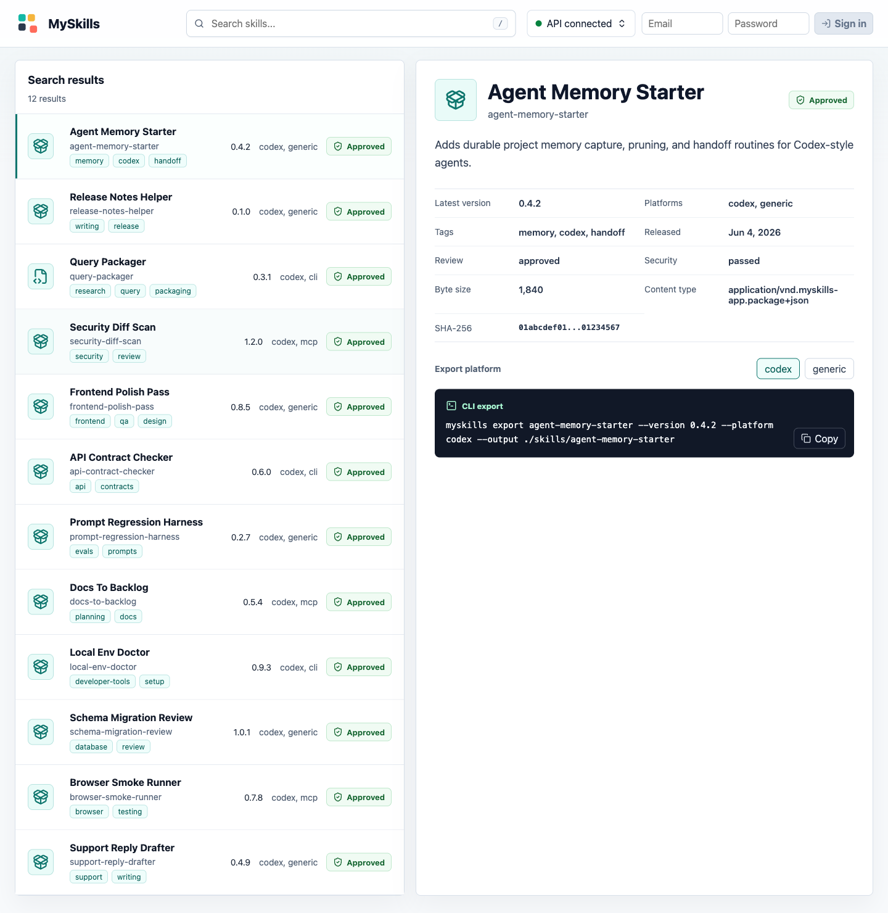

# MySkills

MySkills is an open-source alpha platform for publishing, reviewing, discovering, installing, and using AI agent skills across web, API, CLI, and MCP interfaces.

## Preview



## Release Status

Current target: **v0.1.0-alpha.0**.

This alpha is intended for evaluation, local demos, and early self-hosting feedback. It is not yet the business-safe production release: API contracts, package formats, deployment defaults, and operational guidance may still change before `v1.0`.

## Name

Current name: **MySkills**.

Repository slug: **myskills-app**.

Planned domain: **myskills.sh**.

## Product Goal

Build a production-ready, self-hostable registry for AI skills that supports:

- A web interface for browsing, submitting, reviewing, and managing skills.
- A backend API for search, metadata, submissions, packages, users, roles, audit, and admin operations.
- Skill versioning with semantic releases, lifecycle state, compatibility metadata, install, update, and rollback support.
- MCP tools for agent/client discovery and guided installation.
- A CLI for package authoring, validation, submission, install, export, update, and rollback.
- First-party user accounts with admin-controlled registration, MFA, and optional external identity-provider integrations.
- A proper backend with Postgres as system of record and object storage for package artifacts.

## Repo Shape

```text
apps/
  api/      Backend API service and auth boundary.
  web/      Browser UI.
  cli/      User and maintainer command line.
  mcp/      MCP gateway or standalone transport adapter.
packages/
  auth/           Shared auth and authorization contracts.
  core/           Domain types, policy, errors, and shared utilities.
  skill-package/  Package manifest, validation, scanning, bundling, and install logic.
docs/
  adr/            Architecture decision records.
examples/
  skills/         Public-safe example skill packages.
scripts/
  check-*.mjs     Repo hygiene checks.
```

## Registry Principle

MySkills is compatible with Git-hosted skill workflows, but it treats registry state, review decisions, permissions, package artifacts, and audit history as application data. That keeps it useful for individuals who publish skills from a repository and for teams that need governed workflows beyond source-control permissions.

## Local Setup

```bash
npm install
cp .env.example .env
npm run docker:up
npm run db:migrate
npm run db:seed
npm run dev:api
npm run dev:web
```

The API defaults to `http://localhost:3001`; the web app defaults to `http://localhost:3000`.

```bash
curl http://localhost:3001/health
curl http://localhost:3001/v1/skills
curl http://localhost:3001/v1/skills/release-notes-helper
```

The seeded owner account uses `SEED_OWNER_EMAIL` and `SEED_OWNER_PASSWORD` from `.env`.

Open `http://localhost:3000` to browse approved skills, inspect release export guidance, and sign in with the seeded owner account. The browser UI supports MFA challenge completion when the account requires it, authenticated author `.zip` package submission, maintainer review approval/publication, and owner/admin console workflows for registration mode, user status actions, role updates, provider metadata/mapping management, and audit review.

Local auth verification and password-reset notifications default to `AUTH_NOTIFICATION_MODE=console`; development action links appear in the API process output. Production deployments use `AUTH_NOTIFICATION_MODE=smtp` and must set `APP_BASE_URL` to an HTTPS web origin plus SMTP settings in the environment or secret store.

To run the stdio MCP server, create an API token with `skills:read` scope and start:

```bash
MYSKILLS_TOKEN=<api-token-with-skills-read> npm run dev:mcp
```

To run the stateless Streamable HTTP MCP server, start the HTTP adapter and configure MCP clients to send `Authorization: Bearer <api-token-with-skills-read>` to `POST /mcp`:

```bash
npm run dev:mcp:http
curl http://127.0.0.1:3002/health
```

The current CLI can validate and scan local package directories and `.zip` archives, search and inspect approved releases, submit package directories or server-extracted archive uploads, run maintainer review actions, manage scoped API tokens, and export verified approved bundles:

```bash
npm run build
node apps/cli/dist/index.js login --email "$SEED_OWNER_EMAIL"
node apps/cli/dist/index.js whoami
node apps/cli/dist/index.js search release
node apps/cli/dist/index.js info release-notes-helper
node apps/cli/dist/index.js export release-notes-helper --version 0.1.0 --platform codex --output ./tmp/release-notes-helper
node apps/cli/dist/index.js submit --path ./path-to-skill
node apps/cli/dist/index.js review submissions
node apps/cli/dist/index.js token create --name "Local CLI" --scope profile:read --scope skills:read --scope skills:submit
node apps/cli/dist/index.js logout
```

CLI bearer resolution is `--token`, then `MYSKILLS_TOKEN`, then the stored login token scoped to the normalized API URL.

## Example Skill

A public-safe example package lives at [examples/skills/release-notes-helper](examples/skills/release-notes-helper). It mirrors the seeded demo skill and can be used for CLI validation, local submission tests, and package-format examples:

```bash
npm run build
node apps/cli/dist/index.js validate --path examples/skills/release-notes-helper
node apps/cli/dist/index.js scan --path examples/skills/release-notes-helper
```

## Verification

```bash
npm run check
npm run test:postgres
```

`npm run test:postgres` requires `TEST_DATABASE_URL` to point at a disposable Postgres database whose name includes `test` or `ci`. It resets that database schema before applying migrations.

## Support And Security

Use [GitHub Issues](https://github.com/jremick/myskills-app/issues) for public alpha bugs, setup problems, and feature requests.

Do not report suspected vulnerabilities, exposed secrets, access-control bypasses, or package-safety escapes in public issues. Use GitHub private vulnerability reporting as described in [SECURITY.md](SECURITY.md).

## Deployment

Container packaging is available for production API, web, and optional HTTP MCP services:

```bash
npm run check:prod-env -- --env-file .env.production --require-seed
docker compose --env-file .env.production -f docker-compose.production.example.yml build
```

See [docs/DEPLOYMENT.md](docs/DEPLOYMENT.md) for production Compose, migration/seed order, reverse proxy requirements, and managed-container deployment guidance.

## Release

Release artifacts can be generated from a clean git checkout:

```bash
npm run check
npm run release:artifacts
```

See [docs/RELEASE.md](docs/RELEASE.md) for tag gates, artifact contents, and the release workflow.

The immediate alpha goal is tracked in [docs/ALPHA_RELEASE_GOAL.md](docs/ALPHA_RELEASE_GOAL.md). The later business-safe production release goal is tracked in [docs/BUSINESS_SAFE_RELEASE_GOAL.md](docs/BUSINESS_SAFE_RELEASE_GOAL.md).

## License

[Apache License 2.0](LICENSE) - Copyright 2026 Jarel Remick.

## Current Status

This is the responsible public alpha foundation slice. It has workspace packages, a Fastify API, first-party email/password login with bearer sessions, hash-only email verification and password-reset action tokens, SMTP/dev auth notification delivery, MFA challenge flow, browser login/logout with session-aware API calls, CLI login/logout with API-URL-scoped stored sessions, hashed scoped API tokens, MFA-verified admin provider config and claim-to-role mapping management, public skill search/detail/release/bundle endpoints, skill versioning with release metadata and artifact checksums, MCP token introspection with `skills:read` and session decision audit events, authenticated package intake with server-side archive extraction and scan evidence, maintainer approve/publish actions, a Vite/React web browser for public registry metadata, author `.zip` package submission, maintainer review, and admin workflows including safe local role editing, read-only stdio and stateless Streamable HTTP MCP servers, a starter CLI with verified export, local install/list/update/rollback, and token management, Drizzle/Postgres schema and migrations, Docker Compose for Postgres plus S3-compatible object storage, production container targets and preflight env validation, seed data, a public-safe example skill package, package manifest validation, local package risk scanning, deterministic alpha-release checks, and reproducible release artifacts.
