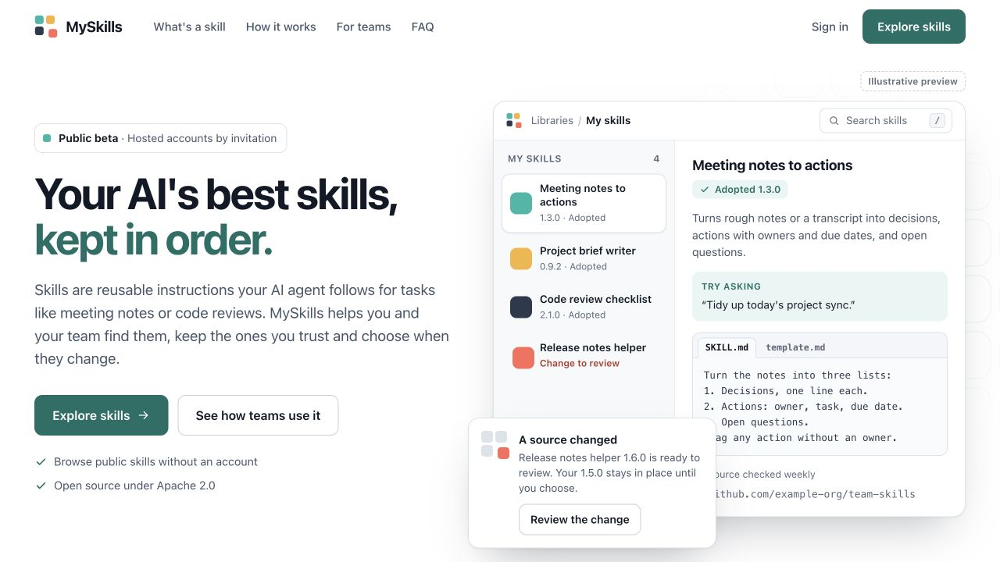

<div align="center">

<picture>
  <source media="(prefers-color-scheme: dark)" srcset="apps/web/public/brand/myskills-icon-dark.svg">
  
</picture>

# MySkills

**Find, review and share reusable AI agent skills.**

An open-source home for your own skills and the ones your team relies on.

[Browse public skills](https://myskills.sh/registry) · [Run locally](#run-locally) · [Self-host](docs/DEPLOYMENT.md) · [Contribute](CONTRIBUTING.md)

</div>

A skill is a folder of instructions, built around a `SKILL.md` file, that an AI agent follows for a task: turning meeting notes into actions, drafting release notes or reviewing code. MySkills helps you find skills, inspect their files and choose which versions to use.



*The homepage preview uses illustrative skill data.*

## Why MySkills?

- **Keep your own library.** Save skills from the registry or a public GitHub repository, inspect their contents and choose a version to adopt.
- **Share reviewed skills with your team.** Use shared libraries, maintainer review, roles and an audit history of key actions.
- **Choose when to update.** Review source changes before adopting them. Install exact versions, preserve local edits and roll back when needed.
- **Keep control of your data.** Self-host the registry, accounts and skill packages on infrastructure you manage.

Use the web app, CLI, HTTP API or MCP server. Managed workspace installation currently supports Codex; export files for other tools according to each skill's compatibility guidance. See [supported platforms and limits](docs/COMPATIBILITY.md).

> **Public beta.** APIs, package formats and deployment defaults may change before 1.0. Try it with non-critical workloads and read the [upgrade policy](docs/UPGRADE_POLICY.md) before updating.

## Try it

[Browse the public registry](https://myskills.sh/registry) without an account. Accounts on [myskills.sh](https://myskills.sh) are invitation-only. Run your own instance to manage your own skills and users.

### Run locally

You need Git, **Node.js 22.13+ within 22.x or Node.js 24.x**, and **Docker with Compose** on macOS or Linux. Docker runs the database and object storage; the app runs through npm.

```bash
git clone https://github.com/jremick/myskills.git
cd myskills
npm install -g "$(node -p 'require("./package.json").packageManager')"
npm ci
cp .env.example .env
npm run build
npm run docker:up
npm run db:migrate
npm run db:seed
```

Start the API in one terminal:

```bash
npm run dev:api
```

Start the web app in another terminal, from the same repository directory:

```bash
npm run dev:web
```

Open **[localhost:3000/registry](http://localhost:3000/registry)**. You should see the seeded **Release Notes Helper** skill. Sign in with `SEED_OWNER_EMAIL` and `SEED_OWNER_PASSWORD` from your local `.env`. These defaults are for local use only.

For smoke checks, troubleshooting and shutdown, see [Getting Started](docs/GETTING_STARTED.md).

### Self-host

The [deployment guide](docs/DEPLOYMENT.md) covers the production Docker Compose example, configuration and first-owner setup. You will need PostgreSQL, S3-compatible object storage, HTTPS and SMTP or Resend for account email.

## Use the CLI or connect an agent

With a supported Node.js version, install the beta CLI and search the hosted public registry:

```bash
npm install -g @jarel/myskills@beta
myskills search release --api-url https://myskills.sh/api
```

Use `@beta` explicitly; npm's default channel currently points to an older alpha. The [CLI guide](apps/cli/README.md) covers authentication, authoring, install, update and rollback.

The [MCP guide](apps/mcp/README.md) covers the source-based stdio and HTTP servers, scoped API tokens and supported client behavior. Agents can discover authorized skills and get install guidance; clients that support the Skills extension can also retrieve verified skill files.

## Learn more and contribute

- [Libraries](docs/LIBRARIES.md) — save sources, review changes and curate shared skills.
- [Architecture](docs/ARCHITECTURE.md) — how the registry, API and clients fit together.
- [Contributing](CONTRIBUTING.md) — development setup and pull request guidance.
- [Support](SUPPORT.md) · [GitHub issues](https://github.com/jremick/myskills/issues) — questions, bugs and feature requests.
- [Security policy](SECURITY.md) — report vulnerabilities privately.
- [Changelog](CHANGELOG.md) — user-facing changes and upgrade notes.

## License

[Apache License 2.0](LICENSE).
