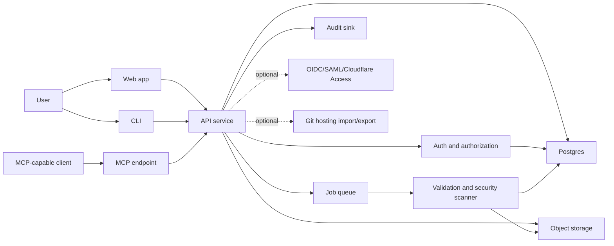
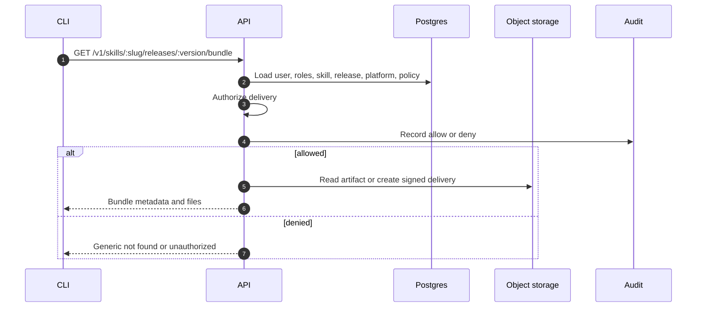

# Architecture

Version: 0.1.0
Last updated: 2026-06-04

## Core Decision

AI Skills Share is a database-backed application. The API service is the trust boundary. Web, CLI, and MCP clients receive only authorized metadata, package artifacts, and workflow results.

Git hosting integrations can help with import, export, PR review, changelogs, and releases, but they are not the canonical registry.

## System View

## Runtime Surfaces

- `apps/api`: backend API, auth boundary, package delivery, moderation, admin, and audit.
- `apps/web`: browser UI consuming the API and shared auth contracts.
- `apps/cli`: command-line client for authors, users, maintainers, and admins.
- `apps/mcp`: MCP transport adapter, likely backed by the same API service.
- `packages/core`: domain contracts, errors, policy decisions, shared types.
- `packages/auth`: auth/session/role contracts and provider mapping helpers.
- `packages/skill-package`: manifest schema, validation, scanning, bundling, install metadata, and package IO.

## Backend Components

### Postgres

Postgres stores canonical product state:

- users, identities, sessions, roles, MFA factors
- skills, versions, releases, platform variants
- packages, artifact references, checksums, scan results
- submissions, reviews, comments, lifecycle actions
- installs, downloads, API tokens, MCP client registrations
- settings, provider mappings, audit events or audit event pointers

### Object Storage

Object storage holds immutable binary and text artifacts:

- uploaded package archives
- extracted release files
- generated validation reports
- export bundles

The database stores object keys, sizes, content types, hashes, provenance, and retention policy.

### Queue

Background jobs handle:

- package extraction and normalization
- validation and security scanning
- checksum generation
- index updates
- notification delivery
- optional Git import/export tasks

### Search

Start with Postgres full-text search for MVP. Add OpenSearch, Meilisearch, Typesense, or vector search only when usage proves the need.

## Trust Boundaries

- The API service is the authorization boundary.
- Clients do not receive raw package files until authorization is complete.
- MCP tools do not bypass API authorization.
- Object storage is private by default. Use short-lived signed URLs only after an authorization check, or stream artifacts through the API.
- External identity providers prove identity, not application authorization. Local roles and policies decide access.
- Uploaded packages are untrusted until validation and scanning pass.

## Package Delivery

## Deployment Shape

The first production-friendly path should support:

- Docker Compose for self-hosted local and small-team deployments.
- Postgres and S3-compatible object storage.
- Worker or Node runtime for API depending on framework fit.
- Optional managed hosting recipes for Cloudflare, Fly.io, Railway, Render, or Vercel.

The app should not require any single vendor to run.

