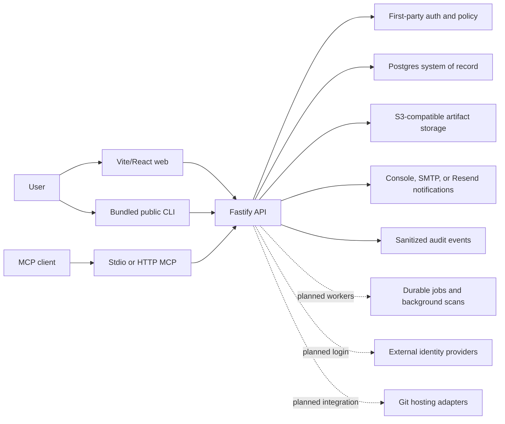
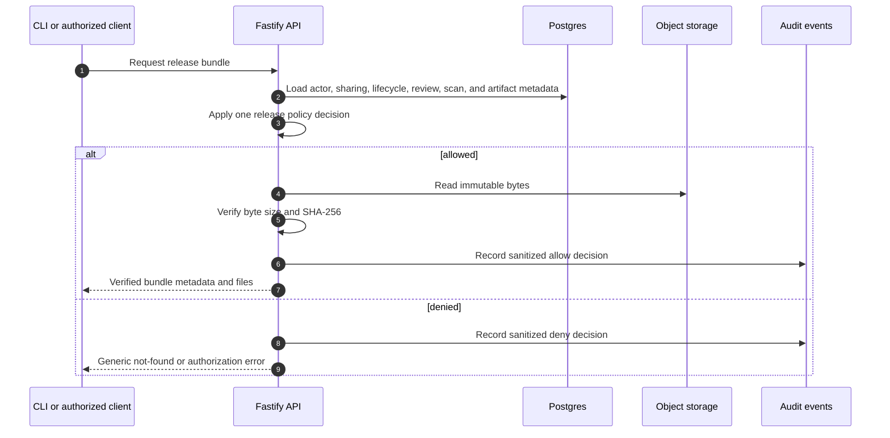

# Architecture

Version: 0.1.0-beta.5
Last updated: 2026-07-13

## Core Decision

MySkills is a database-backed application. The API service is the trust and authorization boundary. Web, CLI, and MCP clients receive only authorized metadata, package artifacts, and workflow results.

Git hosting can support source collaboration, imports, exports, changelogs, and releases, but Git is not the canonical registry. Review decisions, permissions, artifact identity, lifecycle state, sharing, and audit history belong to the MySkills API and Postgres data model.

## Current System

```mermaid
flowchart LR
  User["User"] --> Web["Vite/React web"]
  User --> CLI["Bundled public CLI"]
  Agent["MCP client"] --> MCP["Stdio or HTTP MCP"]

  Web --> API["Fastify API"]
  CLI --> API
  MCP --> API

  API --> Auth["First-party auth and policy"]
  API --> DB["Postgres system of record"]
  API --> Objects["S3-compatible artifact storage"]
  API --> Email["Console, SMTP, or Resend notifications"]
  API --> Audit["Sanitized audit events"]

  API -. planned workers .-> Queue["Durable jobs and background scans"]
  API -. planned login .-> Providers["External identity providers"]
  API -. planned integration .-> Git["Git hosting adapters"]
```

Solid edges are implemented in the beta source. Dashed edges are planned and must not be described as live capabilities.

## Runtime Surfaces

- `apps/api`: Fastify API, first-party auth boundary, package intake/delivery, moderation, lifecycle, teams/sharing, admin, and audit.
- `apps/web`: Vite/React browser UI that consumes API decisions and uses cookie-backed browser sessions.
- `apps/cli`: public `@jarel/myskills` command-line client. The published bundle embeds private workspace package logic and has no private runtime dependency.
- `apps/mcp`: read-only stdio and stateless Streamable HTTP adapters that authorize through the API.
- `packages/core`: shared domain contracts, policy types, errors, and visibility/team primitives.
- `packages/auth`: shared password, session, role, and authorization contracts.
- `packages/skill-package`: private workspace implementation for manifest validation, scanning, package-path safety, and bundle/install logic.

## Data And Artifact Ownership

Postgres stores canonical users, credentials, sessions, MFA state, API tokens, roles, instance settings, rate limits, teams and grants, skills, versions, platform variants, artifact metadata, scan evidence, jobs, provider metadata/mappings, and audit events. [Data Model](DATA_MODEL.md) maps these concepts to the current schema.

Production package bytes live in S3-compatible object storage. Postgres keeps opaque object keys, content types, sizes, and SHA-256 hashes. Artifact writes are write-once per release identity; reads fail closed when stored bytes are missing or fail size/hash verification. Development can use DB-backed normalized payloads, but production startup requires object storage.

Package extraction, validation, and scanning currently run in the request/review workflow. A `jobs` table exists as schema groundwork, but background scan workers, retries, and durable eval execution are planned production-hardening work.

Public search currently uses bounded Postgres `ILIKE` matching across slug, title, and summary. Full-text or external search is not part of the beta implementation.

## Trust Boundaries

- The API owns authentication, authorization, lifecycle, sharing, and public-release decisions.
- Unsafe cookie-authenticated browser requests require an allowed `Origin`; cross-origin session-cookie mutations fail with `COOKIE_ORIGIN_REJECTED` before route logic.
- Browser metadata views do not fetch bundle payloads implicitly.
- MCP tools cannot bypass API authorization and do not return package contents.
- The API applies a shared Postgres-backed request limiter before routes. The raw Node HTTP MCP adapter has a separate bounded IP limiter plus header/body/socket/connection limits; forwarded client IPs are trusted only when proxy hops are configured explicitly.
- Uploaded archives are untrusted until path, size, manifest, extraction, and scan checks pass.
- Maintainer approval is tied to the reviewed artifact SHA-256; publication revalidates the immutable artifact.
- Object storage is private. Delivery is streamed through an authorized API path in the current beta.
- External provider configuration stores only non-secret metadata. Provider secrets belong in deployment secret stores, and provider login/linking is not implemented.

## Package Delivery

```mermaid
sequenceDiagram
  autonumber
  participant Client as CLI or authorized client
  participant API as Fastify API
  participant DB as Postgres
  participant OBJ as Object storage
  participant Audit as Audit events

  Client->>API: Request release bundle
  API->>DB: Load actor, sharing, lifecycle, review, scan, and artifact metadata
  API->>API: Apply one release policy decision
  alt allowed
    API->>OBJ: Read immutable bytes
    API->>API: Verify byte size and SHA-256
    API->>Audit: Record sanitized allow decision
    API-->>Client: Verified bundle metadata and files
  else denied
    API->>Audit: Record sanitized deny decision
    API-->>Client: Generic not-found or authorization error
  end
```

## Deployment Shape

The root [Dockerfile](../Dockerfile) is the production Compose and release-workflow multi-target source:

- `api`: Node 22 LTS runtime running the built Fastify service.
- `web`: Vite assets built with Node 22 LTS and served by nginx with an `/api` proxy.
- `mcp-http`: optional Node 22 LTS HTTP MCP runtime.

Local Docker Compose starts dependencies only; app processes run through npm for development. The production Compose example builds the root multi-target file. CI and release verification additionally build the separate [Dockerfile.api](../Dockerfile.api) and [Dockerfile.web](../Dockerfile.web) used by the live Railway services so hosted image evidence cannot drift behind the actual deployment path. See [Deployment](DEPLOYMENT.md) and [Railway Deployment](RAILWAY_DEPLOYMENT.md).

## Planned Architecture

- Background scan/eval workers with bounded retries and durable evidence.
- External identity login/linking with explicit local-role mapping.
- Signed or direct object delivery that preserves authorization, integrity, and audit.
- Platform-specific installation adapters.
- Backup/restore, monitoring, and incident-response runbooks.
- Optional Git hosting import/export that reconciles through reviewable API changes.
